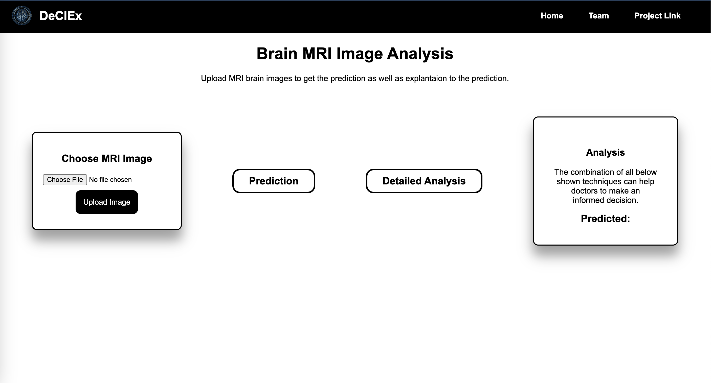
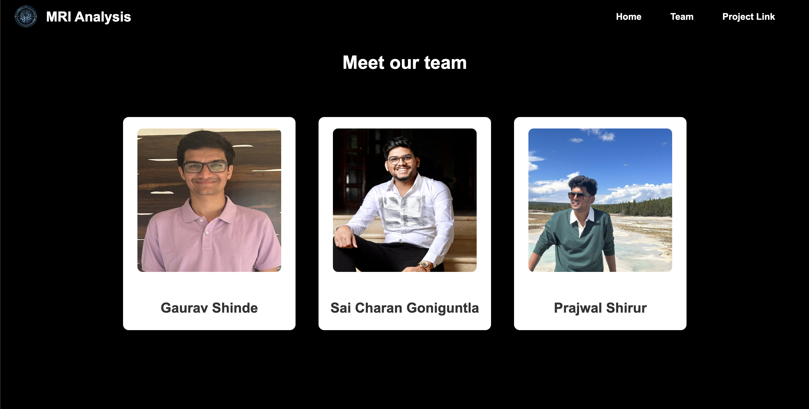

# Introduction
This is an UI application which perform analysis on brain tumor images, and displayed detialed anlysis on them and the basic predictions as well. The code was also hosted on GCP.

## Backend
We have created 3 different APIs,
1. /analyse - this API is used to get basic info like predicted class and the probabilities.
2. /complete_analysis -  this API performs all the setps involved in a segmentaion of lime and shap values and responds with path those images.
3. /images - this API will return the image, for this file: "" in a json body will contain the path provided by above api to get the images from the server.
Examples:
```
curl --location 'http://34.16.167.233:8000/complete_analysis' \
--form 'image=@"/Users/saicharan/Downloads/dataset/Testing/pituitary/Te-pi_0187.jpg"'

curl --location 'http://34.16.167.233:8000/analysis' \
--form 'image=@"/Users/saicharan/Downloads/dataset/Testing/pituitary/Te-pi_0187.jpg"'

curl --location 'http://34.16.167.233:8000/images' \
--header 'Content-Type: application/json' \
--data '{
    "file": "/home/saicharan19995/MasterProject/Brain_Tumor_Analysis/backend/output/2024-04-28/processed_image_20240428063628.png"
}'
```

## Frontend
We have developed 2 simple html files for our UI which contains simple Upload option for the user to enter the input for the model and later buttons to perform anlysis on them. Other page is teams page which has info of all developers info.`





## How to host application on GCP.
1. Create an Clooud Engine, with suffient memory, ideally you can use **c2-standard-4** machine type. CPU platform is **Intel Cascade Lake**. Make sure you have python3.9 and above in the instance created.
2. Check python version using bellow command
``` 
python3 --version
```
3. Install git and clone the project.
``` 
sudo apt install git-all
sudo apt install git-lfs
git clone https://github.com/saicharan19995/Brain_Tumor_Analysis.git
```
4. Setup virual python env and activate it
```
sudo apt install python3-virtualenv
python3 -m virtualenv -p python3 venu
source venu/bin/activate
```
5. Install all requirements
```
pip3 install -r code/requirements.txt
```
6. We need 2 ports which needs to be accessed from external source, So in steps do that
```
Navigate to VPC network details
Select FIREWALLS
Add or edit anyone rule with
IPv4 ranges: 0.0.0.0/0 and ports tcp:3000, 8000
```
7. To run backend and front end.
```
sudo apt install npm
sudo npm install pm2 -g
pm2 start frontend/code/main.py --name brain_tumor --interpretor=python3
pm2 start backend/index.js --name brain_tumor_frontend
pm2 list # To view deployed services
```
8. To get the external ip which can be accessed by all services
```
curl ifconfig.me
```
9. Update the endpoint code in app.js to the new ip.
10. Use bellow URL to access the application
```
http://34.16.167.233:3000/analysis.html
```